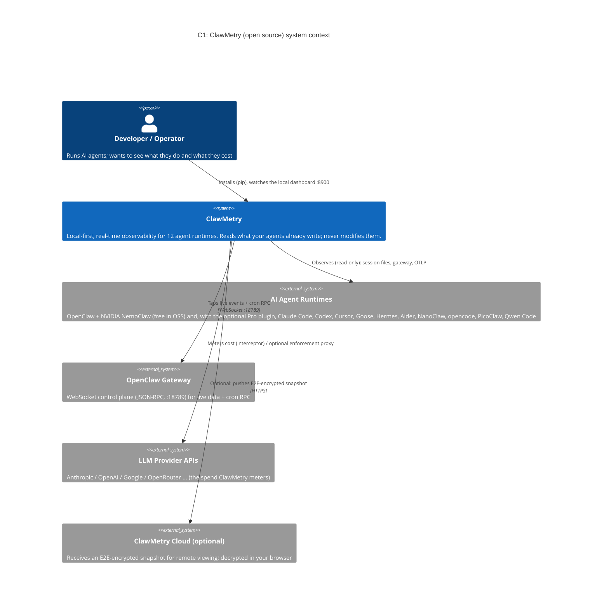
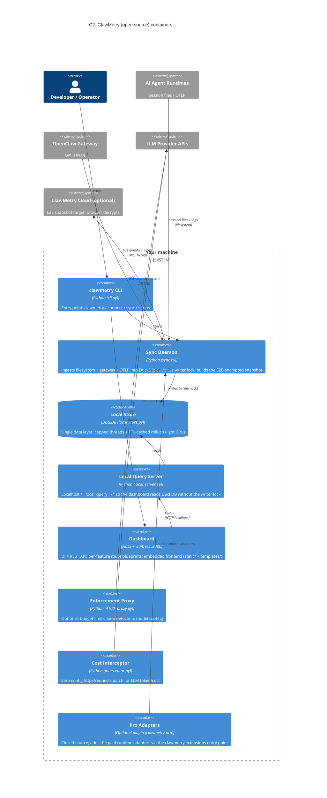

# ClawMetry Architecture — How It Works

> A human-friendly guide to how ClawMetry sees everything your AI agents do.

## The Big Picture

```
┌─────────────────────────────────────────────────────────┐
│                    Your Machine                          │
│                                                          │
│  ┌──────────────┐     reads      ┌──────────────────┐   │
│  │              │ ──────────────► │                  │   │
│  │   OpenClaw   │   filesystem   │    ClawMetry     │   │
│  │   Gateway    │ ◄──────────────│    Dashboard     │   │
│  │              │   WebSocket    │   (Flask app)    │   │
│  │  port 18789  │    JSON-RPC    │   port 8900      │   │
│  └──────┬───────┘                └────────┬─────────┘   │
│         │                                 │              │
│         │  spawns/manages                 │  serves UI   │
│         ▼                                 ▼              │
│  ┌──────────────┐                ┌──────────────────┐   │
│  │  AI Agents   │                │  Your Browser    │   │
│  │  (Claude,    │                │  http://...:8900 │   │
│  │   sessions)  │                └──────────────────┘   │
│  └──────────────┘                                        │
└─────────────────────────────────────────────────────────┘
```

ClawMetry is a **read-only observer** that sits alongside your OpenClaw gateway. It never modifies your agents or their data. It reads what OpenClaw already writes to disk and connects to the gateway's WebSocket API for real-time updates.

## Architecture diagrams (C4 model)

Two views of the open-source app. (Mermaid renders on GitHub.) The optional ClawMetry Cloud is shown as a single opaque box: the daemon only ever sends it an end-to-end-encrypted snapshot, which your browser decrypts locally.

### C1: System context



### C2: Containers (open source)



## Claude Code as a Second Data Source

ClawMetry also supports **Claude Code** (`~/.claude/projects/`) as a data source via a dedicated dashboard (`dashboard_claudecode.py`). Claude Code stores session transcripts as JSONL files with a similar schema to OpenClaw sessions.

```
~/.claude/
├── projects/
│   ├── -Users-you-Developer-myproject/   # Per-project directories
│   │   ├── <session-uuid>.jsonl          # Session transcripts
│   │   └── memory/MEMORY.md              # Project memory
│   └── ...more projects
└── settings.json
```

The Claude Code dashboard is a standalone Flask app that can be:
- Run independently: `python dashboard_claudecode.py --port 8901`
- Mounted as a Blueprint: `app.register_blueprint(bp_claudecode, url_prefix='/claudecode')`
- Deployed at `clawmetry.com/claudecode`

Key differences from the OpenClaw data source:
| Aspect | OpenClaw | Claude Code |
|--------|----------|-------------|
| Session dir | `~/.openclaw/agents/main/sessions/` | `~/.claude/projects/<slug>/` |
| Real-time | WebSocket JSON-RPC | Filesystem polling (10s) |
| Tool names | OpenClaw tools | `Bash`, `Read`, `Write`, `Glob`, etc. |
| Pricing | Gateway-managed | Estimated from model pricing table |

## How ClawMetry Gets Its Data

ClawMetry has **three data sources**, all local to your machine:

### 1. Filesystem Reading (Primary)

OpenClaw stores everything as files. ClawMetry reads them directly:

| What | Where | Format |
|------|-------|--------|
| Session transcripts | `~/.openclaw/agents/main/sessions/*.jsonl` | JSON Lines — one event per line |
| Gateway config | `~/.openclaw/openclaw.json` | JSON — model, channels, auth |
| Gateway logs | `/tmp/moltbot/moltbot-YYYY-MM-DD.log` | Structured JSON logs |
| Memory files | `{workspace}/memory/*.md` | Markdown — agent's daily notes |
| Cron state | Internal gateway state | Via WebSocket RPC |

**Session transcripts** are the richest data source. Each `.jsonl` file contains every message, tool call, tool result, thinking block, and token count for a session. ClawMetry parses these to build timelines, calculate costs, and show what each agent decided.

### 2. Gateway WebSocket (Real-time)

ClawMetry connects to the OpenClaw gateway via WebSocket (`ws://localhost:18789`) using JSON-RPC:

- **Session list** — which sessions are active right now
- **Cron jobs** — scheduled tasks, their status, run history
- **Gateway config** — model settings, channel config
- **Tool invocations** — ClawMetry can invoke gateway tools (e.g., restart crons)

This is how the dashboard updates in real-time without polling.

### 3. OpenTelemetry Receiver (Optional)

ClawMetry can receive OTLP metrics and traces on:
- `POST /v1/metrics` — Prometheus-style metrics in protobuf
- `POST /v1/traces` — Distributed traces in protobuf

This allows external tools or custom instrumentation to feed data into ClawMetry.

## Auto-Detection — Zero Config

When you run `clawmetry`, it automatically finds everything:

1. **Workspace** — Checks `OPENCLAW_HOME`, then `~/.openclaw`, then common paths
2. **Gateway port** — Reads `openclaw.json` for the bind port (default 18789)
3. **Gateway token** — Reads auth token from config for API access
4. **Log directory** — Checks `/tmp/moltbot/` for gateway logs
5. **Sessions directory** — Finds `~/.openclaw/agents/main/sessions/`

No environment variables, no config files, no database setup. If OpenClaw is running, ClawMetry finds it.

## The Dashboard — What You See

ClawMetry serves a single-page web app (frontend in `clawmetry/static/` + `clawmetry/templates/`) with these views:

### Overview (`/api/overview`)
The main dashboard. Aggregates:
- **Active sessions** — main + sub-agents, their status, last activity
- **Token usage** — input/output/cache tokens, cost estimates per session
- **Cron status** — running jobs, failures, next run times
- **System health** — disk, memory, uptime, gateway version

### Flow Visualization
An interactive graph showing how data flows through your system:
```
Channels (Telegram, etc.) → Gateway → Models (Claude, etc.) → Tools → Nodes
```
Each node shows real-time metrics (messages, tokens, calls).

### Session Timeline (`/api/timeline`)
A chronological view of every action in a session:
- User messages, assistant responses
- Tool calls with arguments and results
- Thinking blocks (when reasoning is enabled)
- Token counts per turn

### Transcripts (`/api/transcript/<id>`)
Full conversation history for any session. Supports:
- **Main sessions** — direct user conversations
- **Sub-agent sessions** — background tasks
- **Event filtering** — show only tool calls, only messages, etc.

### Sub-Agent Tracker (`/api/subagents`)
Real-time view of all spawned sub-agents:
- What task they were given
- Their current status (running, completed, failed)
- Token consumption and runtime
- Link to full transcript

### Cost & Usage (`/api/usage`)
Token and cost analytics:
- **Per-model breakdown** — which models consume the most
- **Per-session costs** — find expensive sessions
- **Time series** — cost trends over hours/days
- **Export** — CSV download for billing

### Cron Manager (`/api/crons`)
Full cron job management:
- View all scheduled jobs with next run time
- See run history and errors
- Toggle enable/disable
- Trigger manual runs
- Create and edit jobs

### System Health (`/api/system-health`)
Infrastructure monitoring:
- Disk usage (warns at 85%+)
- Memory consumption
- Gateway uptime and version
- Service port checks
- GPU status (if available)

## Budget & Alerts System

ClawMetry includes a built-in budget monitor:

```
Budget Config → Monitor Loop (every 60s) → Check Spend
                                              │
                              ┌────────────────┼────────────────┐
                              ▼                ▼                ▼
                        Under budget     Warning (80%)    Over budget
                          (no-op)        Send alert       Pause gateway
```

- **Daily/monthly budgets** with configurable limits
- **Alert channels**: Telegram, webhooks, email
- **Auto-pause**: Can automatically pause the gateway when budget exceeded
- **Custom alert rules**: Token spikes, error rates, session duration

## Multi-Node Fleet Mode

For users running multiple OpenClaw instances:

```
┌──────────┐    ┌──────────┐    ┌──────────┐
│  Node A  │    │  Node B  │    │  Node C  │
│ (laptop) │    │  (Pi)    │    │ (server) │
└────┬─────┘    └────┬─────┘    └────┬─────┘
     │               │               │
     └───────────────┼───────────────┘
                     ▼
            ┌────────────────┐
            │   ClawMetry    │
            │  Fleet View    │
            │  (central)     │
            └────────────────┘
```

Nodes register via `POST /api/nodes/register` and send periodic metrics. The fleet view shows all nodes, their health, sessions, and aggregated costs.

Secured with `CLAWMETRY_FLEET_KEY` — nodes must provide the API key to register.

## Technical Details

### Modular Blueprint Architecture
ClawMetry is a Flask app organised as a small core (`dashboard.py`, ~19,000 lines) plus a `routes/` package of feature-scoped Blueprints (sessions, channels, components, usage, health, brain, infra, overview, crons, meta, alerts, fleet_history, nemoclaw). Shared helpers live in `dashboard.py`; the live UI is served from `clawmetry/static/` + `clawmetry/templates/`. Route handlers reach shared helpers via a late `import dashboard as _d`.

This layout keeps the install story simple while letting each feature evolve in its own module:
- Easy to install (`pip install clawmetry`)
- Easy to audit (one Blueprint per feature, see `CLAUDE.md` for the full table)
- Easy to deploy (pure-Python, no build step)
- Portable (runs on a Raspberry Pi)

The HTML/CSS/JS dashboard is served from `clawmetry/static/css/dashboard.css`, `clawmetry/static/js/app.js`, and `clawmetry/templates/tabs/*.html` — not embedded inline in `dashboard.py`.

### Event Data Source Contract
OSS API routes that serve event-derived dashboard data must tag their JSON
response with `_source: "local_store"`. This proves the endpoint used the
local DuckDB store instead of silently falling back to gateway, JSONL, OTLP, or
cloud-only paths.

`routes/__init__.py` provides two route markers for this contract:
- `@event_data` marks new event-derived endpoints for the source canary.
- `@source_exempt(reason="...")` documents intentional exceptions such as
  gateway pass-throughs or OTLP receivers.

`tests/test_oss_routes_source_canary.py` walks Flask's registered URL map,
builds canary URLs from endpoint names, and fails with guidance when an
event-data response omits `_source` or reports anything other than
`local_store`.

### Dependencies
Minimal by design:
- **Flask** — Web server
- **DuckDB** — local store; the sync daemon ingests all events and owns the writer lock; the dashboard reads through the daemon proxy (`/__local_query__/`)
- **Optional**: `opentelemetry-proto` for OTLP support
- **Optional**: `history.py` for time-series storage (SQLite-based)

### History Module (`history.py`)
An optional companion that adds persistent time-series:
- Stores snapshots every 60 seconds in SQLite
- Enables historical charts (token usage over days/weeks)
- Session history with cost trends
- Cron execution history

### LocalStore Durability Contract

`clawmetry/local_store.py` provides the write-side durability guarantee for the sync daemon.

**Ring-buffer → flush → WAL model**:
1. `LocalStore.ingest(event)` appends the event to an in-memory `deque` (ring buffer, max 10 000 slots).
2. When the ring reaches `FLUSH_BATCH` entries (default 1 000) **or** the background flusher timer fires (every 2 s), `_flush_now_locked()` writes the batch to DuckDB inside an explicit `BEGIN / COMMIT` transaction.
3. DuckDB writes the commit to its WAL synchronously before returning. The data is durable: even a `SIGKILL` immediately after `COMMIT` will not lose the row.

**Crash and replay**:
- Events **in the ring buffer at crash time** (not yet flushed) are lost from DuckDB's perspective.
- The daemon source (JSONL transcripts) is never mutated — on restart the daemon re-reads from the beginning and re-ingests all events.
- `INSERT OR IGNORE` on `events.id` (the PRIMARY KEY) makes every re-ingest idempotent: already-committed rows are silently skipped, missing rows are inserted. Final count is always exactly N.

**Invariant asserted in CI**: `tests/test_moat_daemon_crash_recovery.py` — SIGKILL mid-burst + full source replay → `COUNT(*) = COUNT(DISTINCT id) = N`.

### Performance
- **Memory**: ~30-80MB typical
- **CPU**: Negligible (event-driven, no polling loops except health)
- **Disk**: Zero (reads existing files, history.db is optional)
- **Startup**: <2 seconds

### Security
- **Gateway token auth** — Dashboard requires the gateway token to access sensitive APIs
- **Local-only by default** — Binds to `0.0.0.0:8900` but designed for LAN use
- **Read-only** — Cannot modify agent behavior (except cron management via gateway RPC)
- **No external calls** — Your data never leaves your machine

## Data Flow Example

Here's what happens when you open ClawMetry and look at a running sub-agent:

1. **Browser** requests `/api/subagents`
2. **ClawMetry** reads `~/.openclaw/agents/main/sessions/sessions.json` (session index)
3. **ClawMetry** identifies sub-agent sessions, reads each `.jsonl` transcript
4. For each session, it parses events to extract:
   - Task description (from the spawn message)
   - Current status (running if no completion event)
   - Token counts (summed from all assistant turns)
   - Tools used (from tool_use events)
   - Runtime (first event timestamp to last)
5. **ClawMetry** also queries the gateway via WebSocket for live session state
6. **Response** sent to browser as JSON
7. **Browser** renders the sub-agent cards with live-updating metrics

All of this happens in <100ms for typical setups.

---

*ClawMetry is open source under MIT License. See [github.com/vivekchand/clawmetry](https://github.com/vivekchand/clawmetry)*
