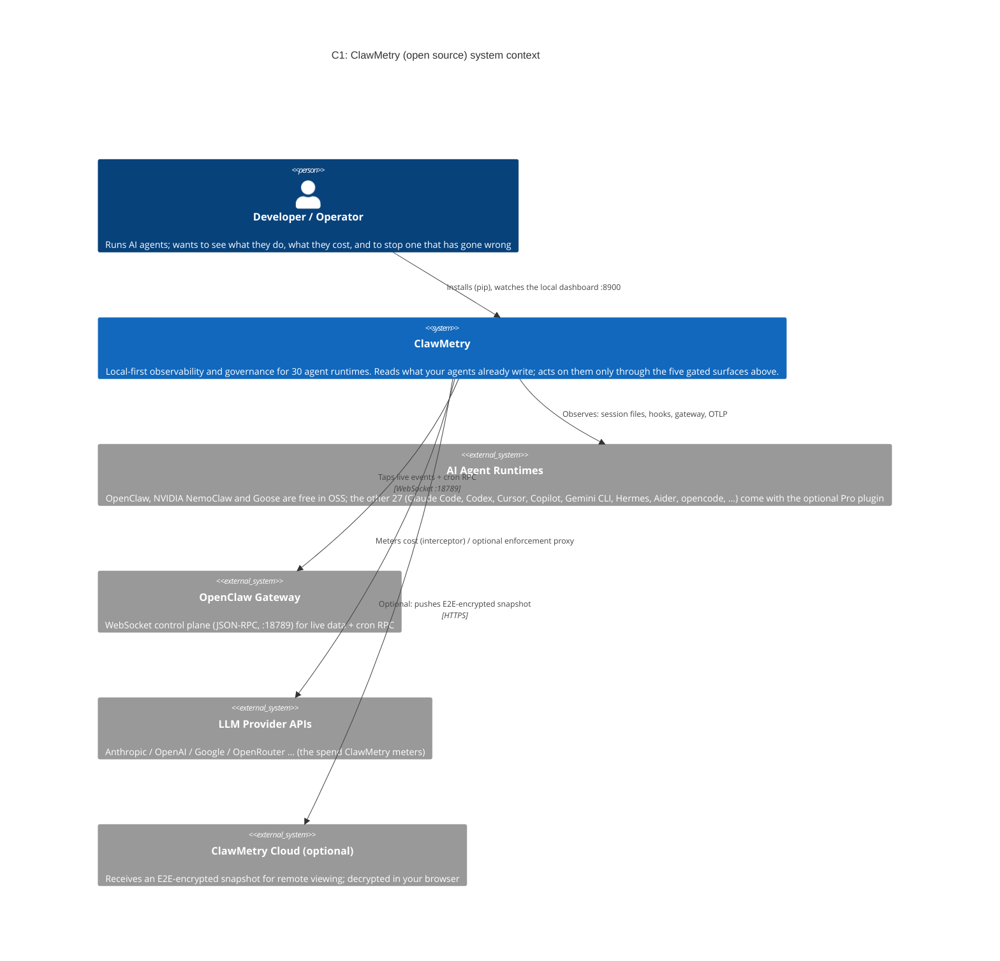
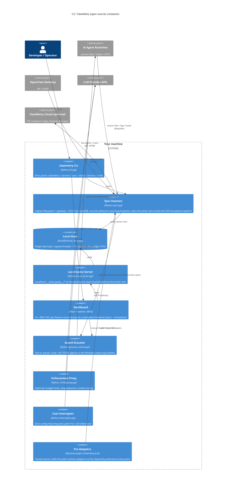

# ClawMetry Architecture — How It Works

> A human-friendly guide to how ClawMetry sees what your AI agents do, and to
> the narrow set of places where it can act on them.
>
> Companion documents: [`CLAUDE.md`](CLAUDE.md) is the working reference for
> agents changing this repo, [`FLYWHEEL.md`](FLYWHEEL.md) is how a change ships
> end to end, and [`docs/MODULE_MAP.md`](docs/MODULE_MAP.md) is the generated
> inventory of every module and blueprint.

## The Big Picture

```
┌──────────────────────────────────────────────────────────────────────┐
│  Your Machine                                                        │
│                                                                      │
│   30 agent runtimes            ClawMetry                             │
│  ┌──────────────────┐        ┌───────────────────────────────────┐   │
│  │ OpenClaw         │  files │  Sync daemon (clawmetry sync)     │   │
│  │ Claude Code      │───────►│  • reads sessions, logs, hooks    │   │
│  │ Codex, Cursor    │        │  • taps the gateway WebSocket     │   │
│  │ Goose, Gemini    │  WS/RPC│  • receives OTLP                  │   │
│  │ ...              │◄──────►│  • owns the DuckDB writer lock    │   │
│  └──────────────────┘        └────────────────┬──────────────────┘   │
│           ▲                                   │ writes               │
│           │                                   ▼                      │
│           │ signals, only              ┌──────────────┐              │
│           │ when you opt in            │   DuckDB     │              │
│           │ (Guard: pause/stop/kill)   │ ~/.clawmetry │              │
│           │                            └──────┬───────┘              │
│           │                                   │ reads (localhost     │
│           │                                   │ query server)        │
│  ┌────────┴──────────────────────────────────▼──────────────────┐   │
│  │  Dashboard (Flask + waitress, 127.0.0.1:8900)                │   │
│  │  REST API + single-page UI, no build step                    │   │
│  └───────────────────────────┬──────────────────────────────────┘   │
└──────────────────────────────┼──────────────────────────────────────┘
                               │ optional, opt-in
                               ▼
                   ClawMetry Cloud (E2E-encrypted snapshot,
                   decrypted in your browser)
```

Everything lands in one local DuckDB store first. The dashboard reads that
store, never the raw files, which is what makes the same code work both
locally and in the hosted view.

## What ClawMetry does, and does not, do to your agents

**Observation is read-only and always on. Intervention exists, is opt-in, and
is off by default.** This document used to say ClawMetry "never modifies your
agents", which stopped being true when Guard shipped. The honest statement is
narrower and more useful: there are exactly five surfaces through which
ClawMetry can affect a running agent, and every one of them is listed here.

| Surface | Where | Gate |
|---|---|---|
| Approval denial ends a session | `clawmetry/approvals.py`; the pre-tool gates that feed it are `clawmetry/claude_code_gate.py` + `routes/hooks.py` | The user answered "deny", or a rule they wrote did. Only where the runtime exposes a hook, and only once installed |
| Signals across the session's process tree (pause / stop / kill) | `routes/guard.py` (manual) and `clawmetry/policy_engine.py` (autonomous), both through `clawmetry/guard_actuator.py` → `clawmetry/process_control.py` | Manual: a human clicked, origin-checked. Autonomous: the three locks below |
| HITL pause | `routes/hitl.py`, a flag file enforced *only* by `clawmetry/proxy.py` | Advisory unless the proxy is actually running, and it says so rather than claiming the agent was held |
| Enforcement proxy: budget block, loop detection, model routing | `clawmetry/proxy.py` (`localhost:4100`) | Only when you point the runtime's base URL at it |
| Cron management | `routes/crons.py` via gateway RPC | User-initiated CRUD |

The three locks on autonomous policy, all required:

1. the policy's own action is `pause` / `stop` / `kill` (new policies default
   to `monitor`, which records what it *would* have done and changes nothing),
2. `CLAWMETRY_POLICY_ENFORCE=1` on the node (default `0`, so one environment
   variable disables every policy on the machine),
3. an entitlement check that fails closed.

Both the manual and the automatic path end in the **same** actuator
(`clawmetry/guard_actuator.py` → `clawmetry/process_control.py`), so a policy
pause and a hand-pressed pause are identical to the agent process.
Whether a given session can be controlled at all is answered in one place,
`process_control.runtime_control_support(runtime, session_id, cwd)`, because
the answer varies by operating system, by runtime, and even by session (a
Cursor CLI session is a real process tree; a Cursor editor conversation shares
the one IDE process and is not controllable). A control that cannot work says
why, next to a disabled button.

Reads never require permission. Writes are user-initiated or declared in a
policy the user wrote, scoped to a single session, reversible where physics
allows, and attributed in the approvals audit table.

## Architecture diagrams (C4 model)

Two views of the open-source app. (Mermaid renders on GitHub.) The optional
ClawMetry Cloud is shown as a single opaque box: the daemon only ever sends it
an end-to-end-encrypted snapshot, which your browser decrypts locally.

### C1: System context


```mermaid
C4Context
title C1: ClawMetry (open source) system context

Person(dev, "Developer / Operator", "Runs AI agents; wants to see what they do, what they cost, and to stop one that has gone wrong")
System(clawmetry, "ClawMetry", "Local-first observability and governance for 30 agent runtimes. Reads what your agents already write; acts on them only through the five gated surfaces above.")

System_Ext(runtimes, "AI Agent Runtimes", "OpenClaw, NVIDIA NemoClaw and Goose are free in OSS; the other 27 (Claude Code, Codex, Cursor, Copilot, Gemini CLI, Hermes, Aider, opencode, ...) come with the optional Pro plugin")
System_Ext(gateway, "OpenClaw Gateway", "WebSocket control plane (JSON-RPC, :18789) for live data + cron RPC")
System_Ext(llm, "LLM Provider APIs", "Anthropic / OpenAI / Google / OpenRouter ... (the spend ClawMetry meters)")
System_Ext(cloud, "ClawMetry Cloud (optional)", "Receives an E2E-encrypted snapshot for remote viewing; decrypted in your browser")

Rel(dev, clawmetry, "Installs (pip), watches the local dashboard :8900")
Rel(clawmetry, runtimes, "Observes: session files, hooks, gateway, OTLP")
Rel(clawmetry, gateway, "Taps live events + cron RPC", "WebSocket :18789")
Rel(clawmetry, llm, "Meters cost (interceptor) / optional enforcement proxy")
Rel(clawmetry, cloud, "Optional: pushes E2E-encrypted snapshot", "HTTPS")
```

### C2: Containers (open source)


```mermaid
C4Container
title C2: ClawMetry (open source) containers

Person(dev, "Developer / Operator", "")
System_Ext(runtimes, "AI Agent Runtimes", "session files / hooks / OTLP")
System_Ext(gateway, "OpenClaw Gateway", "WS :18789")
System_Ext(llm, "LLM Provider APIs", "")
System_Ext(cloud, "ClawMetry Cloud (optional)", "E2E snapshot target; browser decrypts")

System_Boundary(machine, "Your machine") {
    Container(cli, "clawmetry CLI", "Python (cli.py)", "Entry point: clawmetry / connect / sync / status / license / hook")
    Container(daemon, "Sync Daemon", "Python (sync.py)", "Ingests filesystem + gateway + OTLP into DuckDB; runs the detectors and Guard policies; owns the writer lock; builds the E2E-encrypted snapshot")
    ContainerDb(duck, "Local Store", "DuckDB (local_store.py)", "Single data layer; capped threads + TTL-cached rollups (light CPU)")
    Container(lqs, "Local Query Server", "Python (local_server.py)", "Localhost /__local_query__/* so the dashboard reads DuckDB without the writer lock")
    Container(dash, "Dashboard", "Flask + waitress :8900", "UI + REST API; per-feature route blueprints; embedded frontend (static/ + templates/)")
    Container(actuate, "Guard Actuator", "Python (process_control.py)", "Opt-in: pause / stop / kill, POSIX signals or the Windows native equivalents")
    Container(proxy, "Enforcement Proxy", "Python :4100 (proxy.py)", "Optional: budget limits, loop detection, model routing")
    Container(intercept, "Cost Interceptor", "Python (interceptor.py)", "Zero-config httpx/requests patch for LLM token/cost")
    Container(pro, "Pro Adapters", "Optional plugin (clawmetry-pro)", "Closed-source; adds the paid runtime adapters via the clawmetry.extensions entry point")
}

Rel(dev, cli, "runs")
Rel(cli, daemon, "starts")
Rel(cli, dash, "starts")
Rel(runtimes, daemon, "session files / logs / hooks", "filesystem")
Rel(gateway, daemon, "live events + crons", "WS :18789")
Rel(daemon, duck, "writes (writer lock)")
Rel(pro, daemon, "adds runtime adapters")
Rel(dash, lqs, "reads", "HTTP localhost")
Rel(lqs, duck, "reads")
Rel(daemon, actuate, "policy decision (only with all three locks open)")
Rel(dash, actuate, "manual Pause / Stop / Kill")
Rel(actuate, runtimes, "signals one session's process tree")
Rel(intercept, llm, "observes calls")
Rel(proxy, llm, "gates / routes calls")
Rel(daemon, cloud, "E2E snapshot push", "HTTPS")
```

## How ClawMetry Gets Its Data

Five ingest paths, all local to your machine, all landing in the same DuckDB
store. Nothing reads a raw file inside an HTTP handler; see "The data-flow
rule" below for why that matters.

### 1. Filesystem reading (primary)

Agent runtimes store their work as files, and ClawMetry reads them directly.
For OpenClaw:

| What | Where | Format |
|------|-------|--------|
| Session transcripts | `~/.openclaw/agents/main/sessions/*.jsonl` | JSON Lines, one event per line |
| Chat-channel transcripts | `~/.openclaw/<channel>/*.jsonl` | One directory per adapter, 23 of them |
| Gateway config | `~/.openclaw/openclaw.json` | JSON: model, channels, auth |
| Gateway logs | `~/.openclaw/logs/` (older installs and Docker: `/tmp/openclaw`, `/tmp/moltbot`) | Structured JSON logs |
| Memory files | `{workspace}/memory/*.md` | Markdown, the agent's notes |

Every other runtime has its own layout, read by its own adapter: Claude Code
under `~/.claude/projects/<slug>/*.jsonl`, Codex, Cursor, Goose, and the rest.
The daemon loads them from the hardcoded `sync._FAMILY_ADAPTER_SPECS` tuple,
which is the list of adapters that actually get loaded (there is no dynamic
discovery). Free adapters live in `clawmetry/adapters/`; the paid ones arrive
with the `clawmetry-pro` plugin over the `clawmetry.extensions` entry point.

**Session transcripts are the richest source.** Each file carries every
message, tool call, tool result, thinking block and token count for a session,
which is what timelines, costs and detectors are built from.

Family runtimes are polled on a 60s cycle
(`CLAWMETRY_FAMILY_SESSION_LIMIT` bounds how many sessions per runtime are
ingested), the main daemon loop runs every 15s, and the snapshot is rebuilt
every 60s.

### 2. Gateway WebSocket (real-time)

For OpenClaw, ClawMetry connects to the gateway over WebSocket
(`ws://localhost:18789`) using JSON-RPC, for the session list, cron jobs and
config, and for cron CRUD. This is how live data arrives without polling the
filesystem harder.

### 3. OpenTelemetry receiver (optional)

`POST /v1/metrics`, `POST /v1/traces` and `POST /v1/logs` accept OTLP, so any
runtime or custom instrumentation that speaks OTel can feed ClawMetry.
Claude Code's native OTel output lands here. The receiver binds `127.0.0.1` by
default (`CLAWMETRY_OTLP_HOST`).

### 4. Runtime hooks (optional, and the only pre-tool path)

Where a runtime exposes a hook, `clawmetry hook <runtime>` installs one. Hooks
are how ClawMetry sees a tool call *before* it runs, which is what makes
approvals and pre-tool gates possible at all. Hook installation never deletes
a hook it did not write (`clawmetry/hook_ownership.py`); see
[`docs/HOOK_COEXISTENCE.md`](docs/HOOK_COEXISTENCE.md).

### 5. HTTP ingest (bring your own agent)

`routes/runtime_ingest.py` accepts runs from a runtime ClawMetry has no
adapter for, over `POST /api/v1/runs/*`. See
[`docs/CUSTOM_RUNTIME_INGEST.md`](docs/CUSTOM_RUNTIME_INGEST.md).

## The Local Store

`clawmetry/local_store.py` is the single data layer, a DuckDB file at
`~/.clawmetry/clawmetry.duckdb` (schema version 15, ~68 tables). `events` is
the spine; the rest are rollups (`rollup_session`, `rollup_runtime_daily`,
`rollup_model_daily`, `daily_aggregates`) and per-feature tables (`sessions`,
`spans`, `approvals`, `crons`, `loop_signals`, `policy_actions`,
`signal_turns`, `git_commits`, ...).

### One writer, many readers

DuckDB takes an exclusive file lock, so a second process cannot open the file
even read-only. The daemon owns that lock, and hosts an HTTP query server
inside its own process to serve everyone else:

1. On start the daemon binds `127.0.0.1` on an ephemeral port, mints a 32-hex
   token, and writes `{"port", "token", "pid"}` to `~/.clawmetry/local_query.json`
   (mode 0600).
2. The dashboard's `/api/local/*` routes read that file and call
   `http://127.0.0.1:<port>/local/query` with a bearer token.
3. If the daemon is down, the dashboard opens DuckDB directly, which works in
   single-process mode.

The set of methods reachable this way is a declared contract
(`clawmetry/query_contract.py`, rendered to
[`docs/QUERY_CONTRACT.md`](docs/QUERY_CONTRACT.md)), and `make lint-daemon-allowlist`
fails when a route calls a method the daemon does not serve.

### Durability contract

**Ring buffer → flush → WAL**:

1. `LocalStore.ingest(event)` appends to an in-memory `deque` (10,000 slots).
2. At `FLUSH_BATCH` entries (1,000) or on the 2s flusher tick,
   `_flush_now_locked()` writes the batch inside an explicit `BEGIN / COMMIT`.
3. DuckDB commits to its WAL synchronously, so a `SIGKILL` straight after
   `COMMIT` loses nothing.

**Crash and replay**: events still in the ring at crash time are lost from
DuckDB's perspective, but the source (the runtime's own JSONL) is never
mutated, so the daemon re-reads from the beginning on restart.
`INSERT OR IGNORE` on the `events.id` primary key makes every re-ingest
idempotent. Final count is always exactly N.

**Invariant asserted in CI**: `tests/test_moat_daemon_crash_recovery.py`,
SIGKILL mid-burst plus a full source replay, then
`COUNT(*) = COUNT(DISTINCT id) = N`.

### The data-flow rule

Every feature persists to and reads from DuckDB. Reading raw JSONL, log files
or process stats *inside a request handler* is a violation: it works on your
laptop and returns empty in the hosted view, because that container has no
`~/.openclaw`. Most "works locally, broken in cloud" bugs are exactly this.

OSS routes that serve event-derived data tag their JSON with
`_source: "local_store"` to prove which path they used. `routes/__init__.py`
provides `@event_data` (marks an endpoint for the canary) and
`@source_exempt(reason=...)` (documents a deliberate exception such as a
gateway pass-through). `tests/test_oss_routes_source_canary.py` walks Flask's
URL map and fails when an event-data response omits the tag or reports
anything else.

## Auto-Detection — Zero Config

When you run `clawmetry`, it finds everything itself:

1. **Runtimes** — probes every known store root (`clawmetry/runtime_probe.py`)
2. **Workspace** — `OPENCLAW_HOME`, then `~/.openclaw`, then common paths
3. **Gateway port** — read from `openclaw.json` (default 18789)
4. **Gateway token** — read from the same config
5. **Log directory** — `~/.openclaw/logs`, falling back to the legacy `/tmp` paths
6. **Sessions directory** — `~/.openclaw/agents/main/sessions/`

No environment variables, no config file, no database setup.

## The Dashboard — What You See

A single-page app served from `clawmetry/static/` and
`clawmetry/templates/tabs/*.html`, with a runtime switcher in the header that
re-scopes every tab to one runtime. The main views:

| View | Endpoint | What it answers |
|---|---|---|
| Overview | `/api/overview` | Is anything running, what did today cost, what needs me |
| Sessions & transcripts | `/api/sessions`, `/api/transcript/<id>` | What did this agent actually do, turn by turn |
| Sub-agents | `/api/subagents` | What did it spawn, and what did that cost |
| Flow | `/api/flow` | Channels → gateway → models → tools, live |
| Brain | `/api/brain-history`, `/api/brain-stream` (SSE) | The reasoning and tool-call stream as it happens |
| Cost & usage | `/api/usage`, `/api/usage/outcomes` | Spend by runtime, model, session, day; cost per merged change |
| Guard | `/api/guard/sessions`, `/api/guard/policies` | What has gone off track, and the stop button |
| Signals | `/api/signals` | Frustration, refusal, retry and other judge-free rates |
| Trail | `/api/replay-tree/<id>`, `/api/trail/coverage` | One session's typed event trail, and what each runtime can expose |
| Crons | `/api/crons` | Scheduled jobs, history, CRUD |
| Health | `/api/system-health` | Disk, memory, uptime, rate limits, GPU |
| Fleet | `/api/nodes` | Every node, one table |

The full endpoint surface is generated at `/openapi.json` and browsable at
`/api/docs`. The full module and blueprint inventory is
[`docs/MODULE_MAP.md`](docs/MODULE_MAP.md).

## Guard: detectors, policies, and money

Guard is the governance half of the product, and it is deliberately
judge-free: no LLM decides whether your agent is stuck.

**Detectors** run over the tool stream on the daemon tick, in two families:

* **Trajectory** (is it stuck?) — `stuck_loop`, `no_progress`,
  `repeated_tool_failure`, `action_discrepancy`, in `clawmetry/detectors.py`.
* **Behavioural** (is it doing something it does not normally do?) —
  `file_blast_radius`, `credential_access`, `network_egress`,
  `privilege_change`, in `clawmetry/detector_behaviour.py`.

**Thresholds are resolved, not hard-coded.** `detectors.resolve_thresholds()`
layers four sources, each overriding the last: module defaults → the runtime
profile → the cohort's learned baseline from `guard_session_stats` /
`guard_egress_hosts` → a per-runtime environment override
(`CLAWMETRY_NOPROG_TOOLS__CODEX=40`). Every incident carries a
`threshold_source` so a reader can tell a measured threshold from a shipped
constant, and learned values are clamped to a band around the default: a
cohort where everything loops cannot teach Guard to go blind, and three
sessions cannot make it scream.

**Severity maps to money, or says it does not know.** An incident carries
`spend_at_risk_usd` (the cost of the flagged stretch, not the session bill)
plus the `spend_basis` that produced it. Where no cost can be derived the
field is `0.0` with basis `unknown`, never an invented figure, because sorting
a list of incidents by a made-up dollar number is worse than sorting by
severity.

**Policies** turn an incident into an action, evaluated by
`clawmetry/policy_engine.py` under the three locks described at the top. A
policy may carry an escalation ladder (`steps`: `[{action, after_secs}, ...]`)
so the response can be *pause now, kill in five minutes if still stuck*. Rung
0 fires on the match; rung *n* becomes due `after_secs` after rung *n-1*
actually fired, and only if the session is still matching that tick. The
durable latch on `(session_id, policy_id, step_index)` means each rung fires at
most once per session, even across a daemon restart.

## Behaviour Signals

Six preset, judge-free signals over every transcript in the store:
`user_frustration`, `user_praise`, `assistant_refusal`, `assistant_laziness`,
`task_failure`, `user_retry` (`clawmetry/behaviour_signals.py`). Precompiled
word-boundary matchers with negation and positive-context guards run on the
daemon tick over new turns and persist to `signal_turns` / `signal_matches`.
The matched text is never stored. `/api/signals` reports rates per window with
per-runtime coverage, and a runtime that cannot expose the needed text says so
rather than reporting a flattering zero.

## Budget & Alerts

```
Budget config → daemon tick → check spend
                                  │
                  ┌───────────────┼───────────────┐
                  ▼               ▼               ▼
            Under budget    Warning (80%)    Over budget
              (no-op)        Send alert      Alert + optional
                                             enforcement action
```

Daily and monthly budgets, alert channels (Slack, Discord, PagerDuty,
Telegram, email, webhooks), and custom rules including `signal_rate_above`,
which fires on a behaviour signal's rate over a window with a minimum sample.

## Multi-Node Fleet

```
┌──────────┐    ┌──────────┐    ┌──────────┐
│  Node A  │    │  Node B  │    │  Node C  │
│ (laptop) │    │  (Pi)    │    │ (server) │
└────┬─────┘    └────┬─────┘    └────┬─────┘
     │               │               │
     └───────────────┼───────────────┘
                     ▼
            ┌────────────────┐
            │   ClawMetry    │
            │  Fleet View    │
            └────────────────┘
```

Nodes register via `POST /api/nodes/register` and send periodic metrics.
Secured with `CLAWMETRY_FLEET_KEY`.

## Optional Cloud Sync

`clawmetry connect` opts a node into the hosted view. The daemon builds a
snapshot from its own store handle and encrypts it with AES-256-GCM before it
leaves the machine; the key never does, so the browser decrypts client-side and
the server holds ciphertext. Session and content-bearing payloads are always
sealed; a small set of aggregate counters rides the heartbeat in plaintext,
and which is which is declared per method in `clawmetry/query_contract.py`.

Nothing about this is on by default. Without `clawmetry connect` the only
outbound traffic is one install ping and the PyPI version check;
`CLAWMETRY_OFFLINE=1` removes even those. The complete destination list, what
each carries, and how to verify it on the wire is
[`docs/EGRESS.md`](docs/EGRESS.md).

## Technical Details

### Modular blueprint architecture

A Flask app organised as a core (`dashboard.py`) plus a `routes/` package of
feature-scoped blueprints, with helpers migrating into `helpers/`. Route
handlers reach the helpers still living in `dashboard.py` through a late
`import dashboard as _d`, which avoids a circular import.

New endpoints go in `routes/<feature>.py`, never in `dashboard.py`. That rule
replaced an older "keep it in one file" convention, which became
counterproductive somewhere north of 30,000 lines: illegible to humans, and a
guaranteed merge conflict for every parallel PR.

The complete list of modules, their blueprints and the URL space each owns is
generated into [`docs/MODULE_MAP.md`](docs/MODULE_MAP.md) by
`scripts/gen_module_map.py`; CI fails when it drifts from the source tree.

This layout keeps the install story simple while letting each feature evolve
on its own:

- Easy to install (`pip install clawmetry`)
- Easy to audit (one blueprint per feature)
- Easy to deploy (pure Python, no build step)
- Portable (runs on a Raspberry Pi)

The UI is served from `clawmetry/static/css/dashboard.css`,
`clawmetry/static/js/app.js` and `clawmetry/templates/tabs/*.html`.
`dashboard.py` defines `DASHBOARD_HTML` twice and the **second** definition
wins; the inline copy earlier in the file is dead code.

### Entitlements & open-core

ClawMetry is open-core. `clawmetry/entitlements.py` is the single source of
truth for what an install may do, and for the runtime and channel catalogues
that every count in this repo is derived from. `clawmetry/license.py` verifies
self-hosted license keys offline with Ed25519, using the `cryptography`
dependency rather than a new one. `routes/entitlement.py` exposes the resolved
entitlement at `/api/entitlement*`.

The resolver runs in **GRACE** mode until the announced enforce date: every
`allows_*` check answers "allowed" regardless of tier, so wiring the gate into
a new feature changes no behaviour today. Set `CLAWMETRY_ENFORCE=1` to turn it
on. Entitlement failures fail *open*: a licence lookup that errors leaves the
agent running, because a billing bug must never stop a customer's work. Policy
failures fail *closed*. See [`docs/ENTITLEMENTS.md`](docs/ENTITLEMENTS.md).

### Dependencies

Minimal by design; `setup.py` is the source of truth.

- **flask**, **waitress** — HTTP server
- **duckdb** — the local store
- **cryptography** (with a per-interpreter **cffi** pin) — AES-256-GCM for the snapshot envelope
- **websocket-client** — the cloud relay tunnel
- **truststore** (3.10+) and **certifi** — so corporate TLS interception works
- **Optional**: `clawmetry[otel]` for OTLP, `clawmetry[deepeval]` for the eval bridge
- **Optional**: `history.py`, a separate SQLite time-series (snapshots every 60s for long-range charts)

### Performance

ClawMetry runs on your machine all day, so it is budgeted like a sidecar, not
a warehouse.

- **CPU**: the daemon idles near zero and is held to roughly 5-10% of one core.
  DuckDB connections pass an explicit thread cap (default 2) and a memory
  ceiling derived from the store size, because DuckDB otherwise defaults to
  every core on the box. Hot rollups are result-cached with a short TTL
  (`CLAWMETRY_AGG_CACHE_TTL`, default 20s) so handlers never run a full-table
  scan per request.
- **Memory**: tens of MB for the dashboard; the daemon's footprint follows the
  DuckDB buffer pool.
- **Disk**: the store grows with your history. It is compacted, and
  `docs/EVENT_RETENTION.md` covers trimming it.
- **Startup**: under 2 seconds.

### Security

- **Loopback by default** — the dashboard binds `127.0.0.1:8900`; `--host` is
  how you widen that, deliberately.
- **Token auth** — sensitive APIs require the gateway token; the daemon's
  localhost query server requires a per-boot bearer token and a 0600 port file.
- **Observation is read-only; intervention is opt-in** — the five surfaces at
  the top of this document are the complete list, and adding a sixth means
  adding it there with locks of the same strength.
- **A user's repository is read, never written** — `clawmetry/git_outcomes.py`
  is the only place ClawMetry runs `git` against a directory you chose, and
  every invocation goes through one chokepoint that rejects anything outside an
  allowlist of read-only plumbing subcommands.
- **Egress is documented and verifiable** — see [`docs/EGRESS.md`](docs/EGRESS.md).
  No ClawMetry deployment loads a CDN, font, analytics script or error tracker.

## Data Flow Example

What happens when you open the dashboard and look at a running sub-agent:

1. **The daemon**, on its 15s tick, reads new lines from each runtime's session
   files and any gateway or OTLP events, normalises them, and ingests them into
   the DuckDB ring buffer.
2. **The ring flushes** to DuckDB within 2 seconds (or immediately at 1,000
   events), inside one transaction. Rollups and detector passes run on the same
   tick.
3. **Your browser** requests `/api/subagents`.
4. **The dashboard** calls the daemon's localhost query server, which runs the
   query against the store the daemon already has open. No file in
   `~/.openclaw` is touched by the handler.
5. **The response** carries `_source: "local_store"`, which is what the source
   canary in CI asserts.
6. **The browser** renders the sub-agent cards.

The same handler serves the hosted view, where step 4 reads a decrypted
snapshot slice instead of a local store. That is the whole reason the rule in
step 4 exists.

---

*ClawMetry is open source under the MIT License. See
[github.com/vivekchand/clawmetry](https://github.com/vivekchand/clawmetry)*
